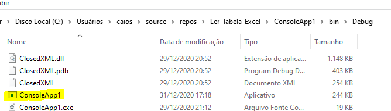

# API-CORREIOS-C#

 Programador – Caio Silveira Telles Email:caiosilveiratelles@gmail.com

Desafio proposto: A rotina deverá extrair todos os dados exibidos no portal dos correios do respectivo CEP. Os dados extraídos devem ser armazenados em um outro arquivo excel chamado “Resultado.xlsx”. Este arquivo deverá conter a listagem de todas as informações extraídas do portal dos correios mais a data/hora/minuto do processamento das informações.
Para construir o a rotina preferencialmente utilize a linguagem C#. A rotina poderá ser construída utilizando a navegação por Selenium ou requisição/request (isso será um diferencial).
Ao finalizar, monte um arquivo word explicando o funcionamento dela e quais características técnicas ela utiliza (por exemplo, navegação, performance atingida, quantidade de dados processadas etc.).

Código implementado Explicação:
Ideia Geral da aplicação: inicialmente abrimos o arquivo Excel previamente construído , Analisamos cada linha a fim de analisar as faixas de CEPS
Por Exemplo faixa inicial = 17514532
Faixa final = 17514600 
Programa Por meio de um API com os Correios , faz uma busca rapidamente por cada cep dentro dessa faixa , foi criado um somador ++ , de faixa inicial ate a final , cada cep chama a função ConsultaCEP() a mesma é a responsável por localizar o cep nos correios por meio da api(Request)  em C# , caso encontro , as informações são incluídas dentro de um array dinâmicos e vai para o próximo cep , caso o retorno da api seja 404 , não encontro o mesmo o programa ignora e vai para o, Existem dois contadores os das faixas e das Linhas do Excel , Após percorrer todos os mesmos com o Array(CepsValidos) , Chamamos a função VerifyAPI() a mesma é responsável por chama analisar e enviar os dados para a função CriaExcel() , a mesma recebe quantos ceps foram localizados e preenchidos , Após receber a mesma cria uma nova worksheet do excel , Preenchemos os dados por linha de cada cep e a hora da execução da request , sendo assim no total 6 colunas no excel e as linhas dinamicamente dependendo das faixas, Lembrando que para a economia de memoria e processamento toda execução é removida do cache para não ocupar espaço , sendo assim a única variável que fica salva são os contadores e o Array De ceps , Tornando a aplicação leve para todas as maquinas , trazendo uma boa performasse ,Após toda a consulta de dados salvamos o Array CepsValidos no Excel e com o nome “Resultado.xlsx”.
A Quantidade de dados processados é variável pelo fato de depender do tamanho e das faixas do excel que serve como nossa base de dados de pesquisa , Mais o programa pesquisa 1 cep a cada 0.10 s , e salva a resposta no array em no máximo 0,15 segundos , sendo um algoritmo rápido .

Tecnologias usadas  : como compilador Visual Studio 19 
Linguagem C# , foram usadas algumas bibliotecas para a criação 
using ClosedXML.Excel; //importação do pacote CLOSEDXML
using DotNet.CEP.Search.App;//API CEP

 Para a utilização da aplicação deve se trocar o caminho da extração dos dados e onde será salva , Poderia fazer dinamicamente para seu disco local porém não sabia se ia ser testado em algum servidor restrito ou maquina de trabalho preferi o avaliador escolher o caminho

Alterar as linhas para o uso

  var tabela = new XLWorkbook(@"C:\Users\caios\Desktop\importar_ceps\bairro-taxa.xlsx"); //colocar o caminho da pasta com o arquivo XLSM do EXCEL
            
wb.SaveAs(@"C:\Users\caios\Desktop\importar_ceps\Resultado.xlsx");//SALVA o resultado no seu disco local

Podemos rodar pelo compilador ou, Acessando a pasta da aplicação e rodando o executável 

  

 
Caminho da aplicação a sua escolha.
Lembrando que o Excel precisa estar instalado na sua maquina, e a sua planilha não pode está aberta que o programa necessita de exclusividade na execução .

